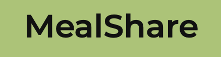

<div id="top"></div>

![html-badge]
![css-badge]
![python-badge]
[![Contributors][contributors-shield]][contributors-url]
[![Stargazers][stars-shield]][stars-url]
[![MIT License][license-shield]][license-url]
[![LinkedIn][linkedin-shield]][linkedin-url]


<!-- PROJECT LOGO -->
<br />
<div align="center">
  <a href="https://github.com/francinv/TDT4140-Middagsdeling">
    
  </a>

<h3 align="center">MealShare</h3>

  <p align="center">
    MealShare is for sharing meals with others, if you for example have made to much food, or you just want to eat with someone else. 
    <br />
    <br />
    <a href="https://middagsdeling-staging.herokuapp.com">View Deployed App</a>
    ·
    <a href="https://github.com/francinv/TDT4140-Middagsdeling/issues">Report Bug</a>
    ·
    <a href="https://github.com/francinv/TDT4140-Middagsdeling/issues">Request Feature</a>
  </p>
</div>


<!-- TABLE OF CONTENTS -->
<details>
  <summary>Table of Contents</summary>
  <ol>
    <li>
      <a href="#about-the-project">About The Project</a>
      <ul>
        <li><a href="#built-with">Built With</a></li>
      </ul>
    </li>
    <li>
      <a href="#getting-started">Getting Started</a>
      <ul>
        <li><a href="#prerequisites">Prerequisites</a></li>
        <li><a href="#installation">Installation</a></li>
      </ul>
    </li>
    <li><a href="#usage">Usage</a></li>
    <li><a href="#contributing">Contributing</a></li>
    <li><a href="#license">License</a></li>
    <li><a href="#contact">Contact</a></li>
  </ol>
</details>


<!-- ABOUT THE PROJECT -->
## About The Project

[![Product Name Screen Shot][login-screenshot]](https://middagsdeling-staging.herokuapp.com)

***Test out the app by clicking the image***

MealShare (Middagsdeling) is an app created during the course Software Development (PU). During the development of this APP I got a good introduction to agile methods and TDD (test-driven development). We used Scrum as our framework, and followed it during the iterations. 

During this project I also got a good introduction to the django framework and have since fallen in love with it :heart_eyes:

In the section, ***Usage*** I will go more into depth on how you can use the APP. 

<p align="right">(<a href="#top">back to top</a>)</p>


### Built With

* [Django](https://www.djangoproject.com)

<p align="right">(<a href="#top">back to top</a>)</p>


<!-- GETTING STARTED -->
## Getting Started

As mentioned the app is deployed to heroku. The APP can be accessed here:
[https://middagsdeling-staging.herokuapp.com](https://middagsdeling-staging.herokuapp.com). If you want to run the app locally, please follow the steps below. 

### Prerequisites

You must have python installed.
* pip
  ```sh
  pip install --upgrade pip
  ```

### Installation and running

1. Clone the repo
   ```sh
   git clone https://github.com/francinv/TDT4140-Middagsdeling.git
   ```
2. Initialize virtual environment
    ```sh
    pipenv shell
    ```
3. Install requirements
   ```sh
   pipenv install
   ```
4. Start App
   ```sh
   python manage.py runserver
   ```

<p align="right">(<a href="#top">back to top</a>)</p>


<!-- USAGE EXAMPLES -->
## Usage

Use this space to show useful examples of how a project can be used. Additional screenshots, code examples and demos work well in this space. You may also link to more resources.

_For more examples, please refer to the [Documentation](https://example.com)_

<p align="right">(<a href="#top">back to top</a>)</p>


<!-- CONTRIBUTING -->
## Contributing

Contributions are what make the open source community such an amazing place to learn, inspire, and create. Any contributions you make are **greatly appreciated**.

If you have a suggestion that would make this better, please fork the repo and create a pull request. You can also simply open an issue with the tag "enhancement".
Don't forget to give the project a star! Thanks again!

1. Fork the Project
2. Create your Feature Branch (`git checkout -b feature/AmazingFeature`)
3. Commit your Changes (`git commit -m 'Add some AmazingFeature'`)
4. Push to the Branch (`git push origin feature/AmazingFeature`)
5. Open a Pull Request

<p align="right">(<a href="#top">back to top</a>)</p>


<!-- LICENSE -->
## License

Distributed under the MIT License. See `LICENSE` for more information.

<p align="right">(<a href="#top">back to top</a>)</p>


<!-- CONTACT -->
## Contact

Francin Vincent - [@francinvincent][linkedin-url] - francin.vinc@gmail.com

Project Link: [https://github.com/francinv/TDT4140-Middagsdeling](https://github.com/francinv/TDT4140-Middagsdeling)

<p align="right">(<a href="#top">back to top</a>)</p>


<!-- MARKDOWN LINKS & IMAGES -->
<!-- https://www.markdownguide.org/basic-syntax/#reference-style-links -->
[contributors-shield]: https://img.shields.io/github/contributors/francinv/TDT4140-Middagsdeling.svg?style=for-the-badge
[contributors-url]: https://github.com/francinv/TDT4140-Middagsdeling/graphs/contributors
[stars-shield]: https://img.shields.io/github/stars/francinv/TDT4140-Middagsdeling.svg?style=for-the-badge
[stars-url]: https://github.com/francinv/TDT4140-Middagsdeling/stargazers
[license-shield]: https://img.shields.io/github/license/francinv/TDT4140-Middagsdeling.svg?style=for-the-badge
[license-url]: https://github.com/francinv/TDT4140-Middagsdeling/blob/master/LICENSE
[linkedin-shield]: https://img.shields.io/badge/-LinkedIn-black.svg?style=for-the-badge&logo=linkedin&colorB=555
[linkedin-url]: https://linkedin.com/in/francinvincent
[login-screenshot]: docs/login_page.png
[homepage-screenshot]: docs/home_page.png
[html-badge]: https://img.shields.io/badge/HTML5-E34F26?style=for-the-badge&logo=html5&logoColor=white
[css-badge]: https://img.shields.io/badge/CSS3-1572B6?style=for-the-badge&logo=css3&logoColor=white
[python-badge]: https://img.shields.io/badge/Python-3776AB?style=for-the-badge&logo=python&logoColor=white
[django-badge]:https://img.shields.io/badge/Django-092E20?style=for-the-badge&logo=django&logoColor=white